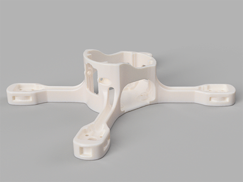
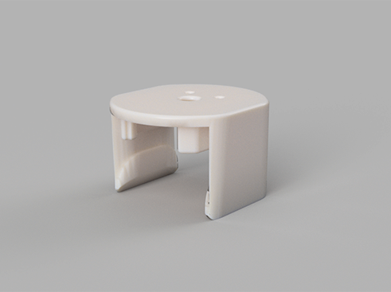

# 3D-печать рамы

На данной странице представлены 3D модели деталей рамы квадрокоптера Race Mini. Вы можете использовать их для самостоятельной печати запасных частей.  
Мы рекомендуем начать освоение Race Mini именно с этой рамы.

Изображение | Описание | Файл
:----------:|:--------:|:----:
|Основа рамы|<a href="../res/OPEN frame 130mm v37.STL" download>OPEN frame 130mm v37.STL</a>
|Верхняя крышка рамы|<a href="../res/OPEN frame TOP 130mm v34_04.STL" download>OPEN frame TOP 130mm v34_04.STL</a>

Рекомендуемые параметры печати: заполнение: 100%, материал: [REC PETG](https://rec3d.ru/plastik-dlya-3d-printerov/relax/relax-plastik-rec-1-75mm-prozrachnyj/), принтер: [Designer X PRO](https://picaso-3d.ru/ru/products/printers/designer-x-pro/), сопло: 0.5 мм, высота слоя: 0.2 мм.

>[Кстати, по промокоду](https://rec3d.ru/plastik-dlya-3d-printerov/) **RaceMini** [вы можете купить весь пластик фирмы REC со скидкой 7%](https://rec3d.ru/plastik-dlya-3d-printerov/)
