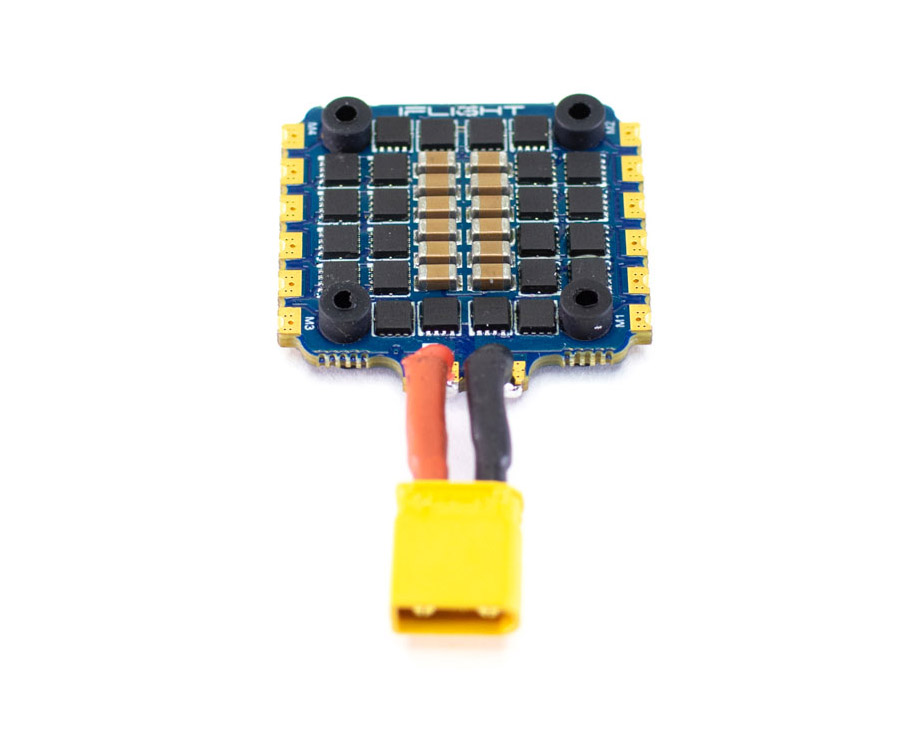
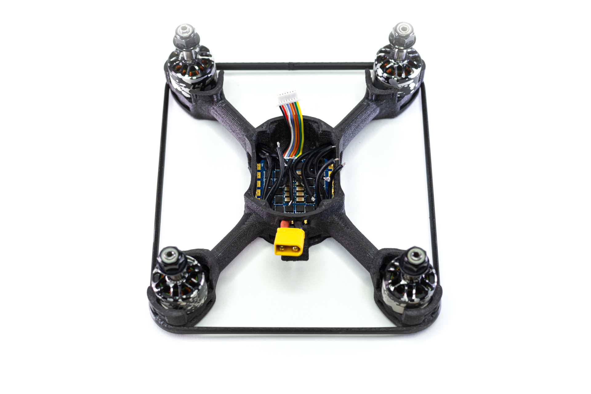
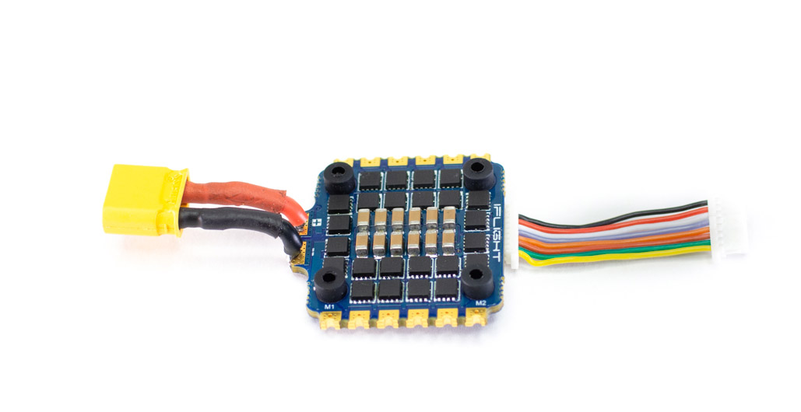
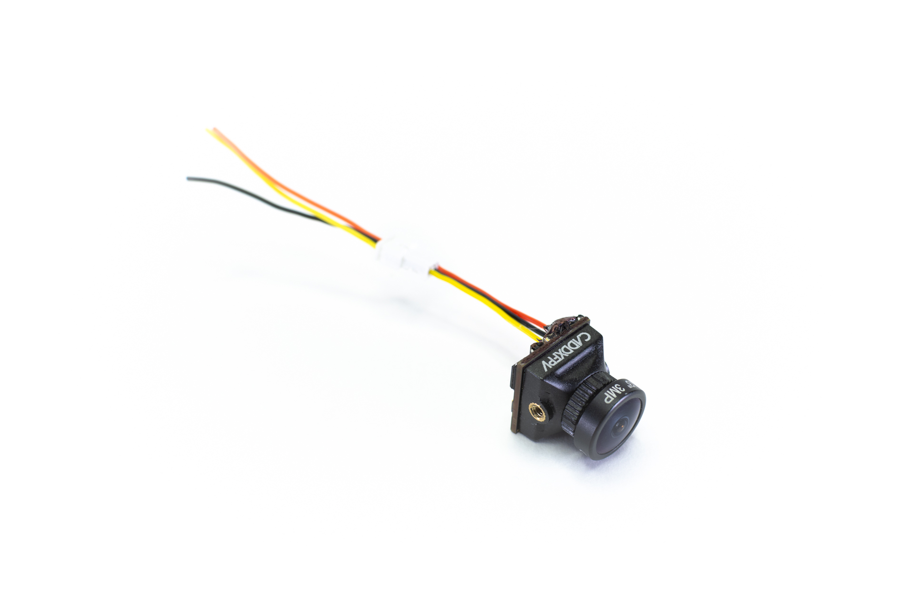
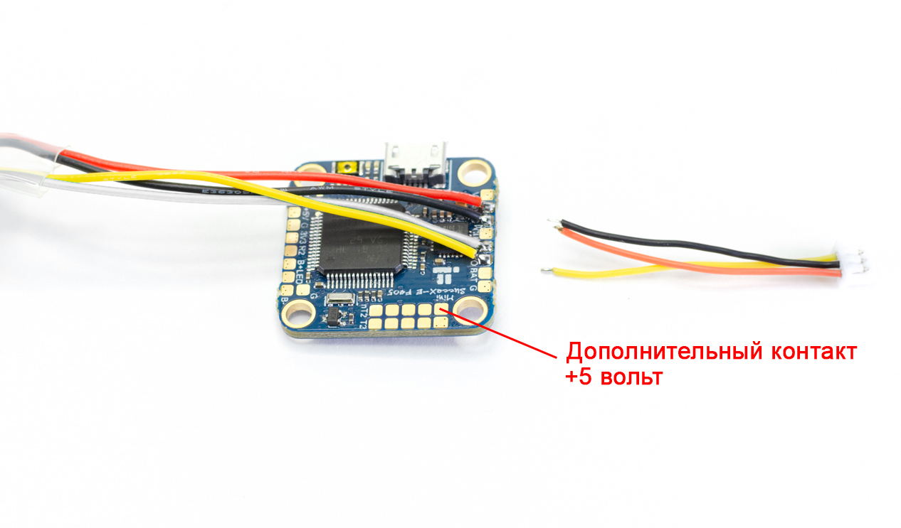
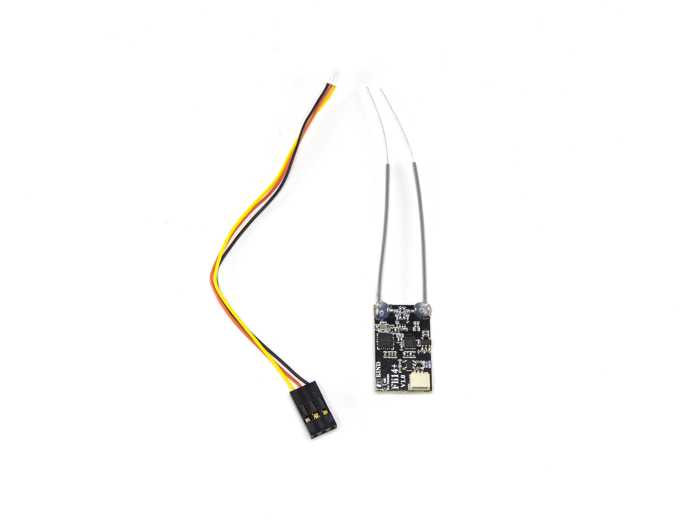
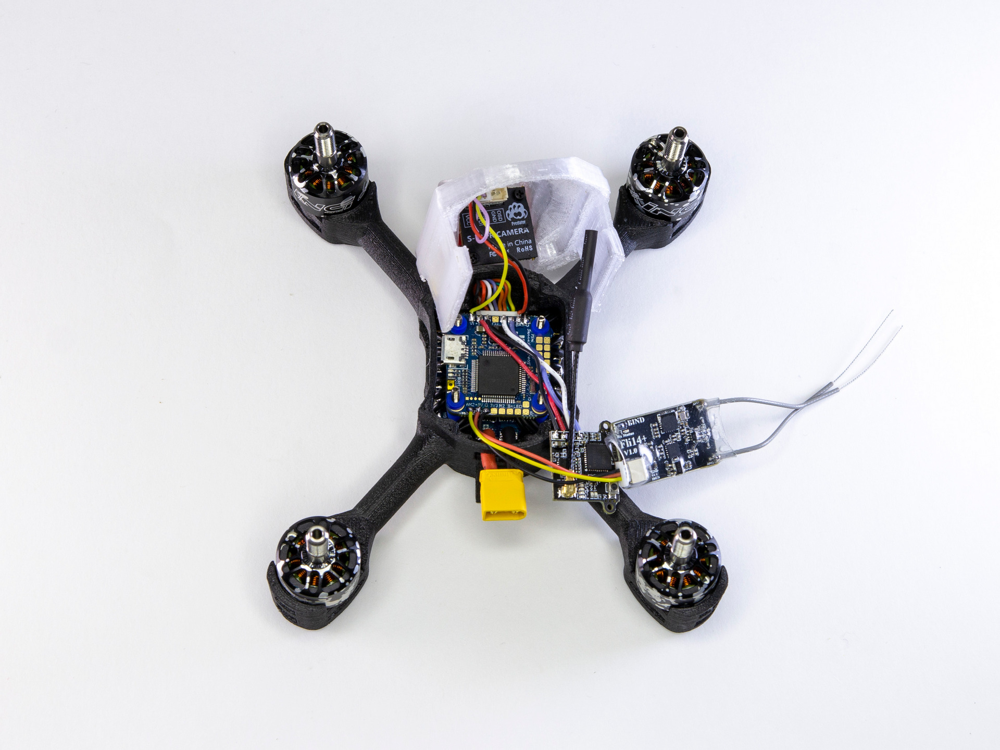
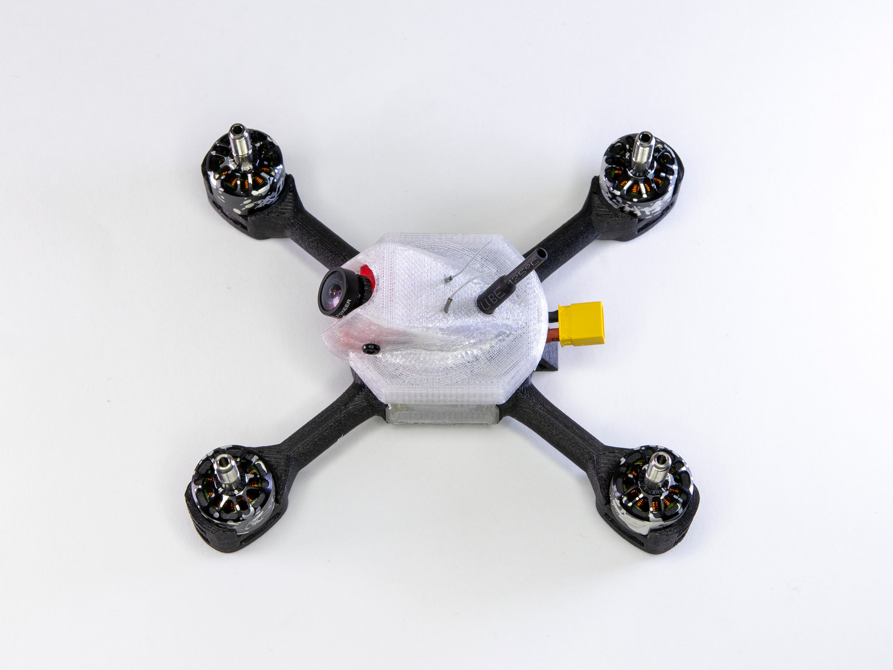
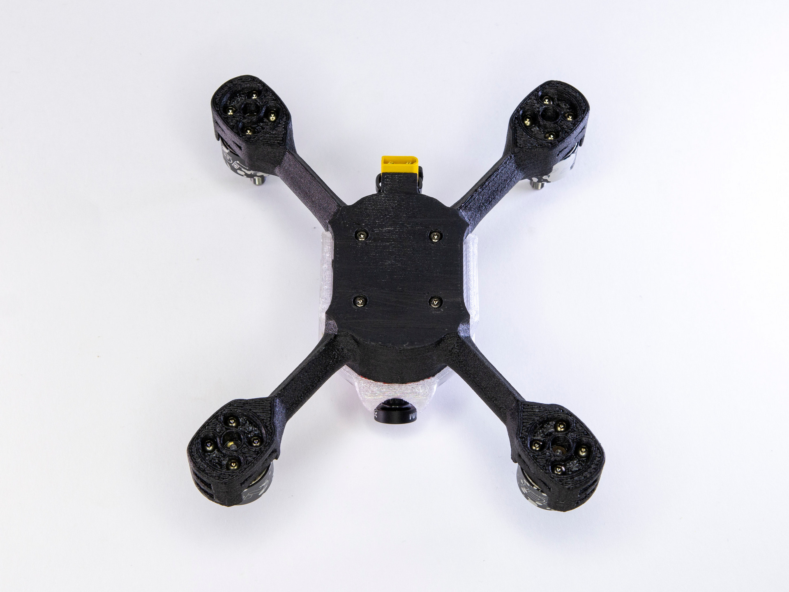

# Сборка гоночного дрона COEX Race Mini

COEX Race Mini - дрон который предназначен для гонок! При помощи него вы с легкостью освоите спортивное пилотирование.
Тренируйтесь и побеждайте! Увидимся на соревнованиях

## Комплект поставки
Внешний вид коробки:

Содержимое:

## Установка моторов

Изначально моторы поставляются с проводами одинаковой длины:

Два мотора (они будут вращаться по часовой стрелке) обрежьте как показано на рисунке: нижний провод должен быть длиной 60 миллиметров, обозначим его буквой А; средний провод должен быть длиной 65 миллиметров, обозначим его буквой В; верхний провод должен быть длиной 70 миллиметров, обозначим его буквой С.

Другие два мотора (они будут вращаться против часовой стрелки) обрежьте как показано на другом рисунке:

Снимите 3 миллиметра изоляции с каждого провода и залудите их. Расположение моторов на дроне будет следующим: моторы, вращающиеся против часовой стрелки находятся на местах 2 и 4, моторы, вращающиеся по часовой стрелке располагаются на местах 1 и 3. На данном рисунке направление переда рамы обозначено стрелкой.

Установите моторы на места используя винты М2 из набора моторов:

## Установка ESC
Внешний вид ESC и кабеля питания:

Обрежьте кабель питания до длины в 20 миллиметров:

Снимите три миллиметра изоляции и залудите провода. Припаяйте их к плате, соблюдая полярность: красный провод необходимо подключить к контакту, обозначенному знаком +, а черный - к контакту, обозначенному знаком - :

Установите силиконовые проставки в отверстия:

Поместите плату регуляторов в корпус. Это проще сделать пока длинные винты которые ее держат еще не закручены:

Вставьте длинные винты М2 с обратной стороны рамы и закрутите их:

Припаяйте выводы моторов к контактным площадкам: на рисунке ниже буква А соответствует короткому проводу, буква В - среднему, а буква С - длинному проводу.

Всавьте шлейф в разъем платы регуляторов:

## Установка полетного контроллера

Внешний вид полетного контроллера:

### Подключение видеопередатчика
Внешний вид видеопередатчика:

Припаяйте провода к видеопередатчику:

Припаяйте провода к полетному контроллеру в указанной последовательности:

### Подключение камеры
Внешний вид камеры:

Обрежьте провода, идущие от камеры как показано на рисунке:

Припаяйте провода к полетному контроллеру:

### Подключение радиоприемника
Внешний вид радиоприемника:

Обрежте провода, идущие от радиоприемника и припаяйте их к полетному контроллеру:

## Установка камеры
Установите камеру в крушку корпуса, как показано на рисунках:

## Финальная сборка
Разместите все компоненты внутри корпуса и закройте крышку:

Зафиксируйте разъем питания стяжкой:

Наклейте антискользящую накладку снизу корпуса:

Установите ремешок для крепления аккумулятора:

Сборка дрона завершена. Можно приступить к настройке полетного контроллера и полетам.
