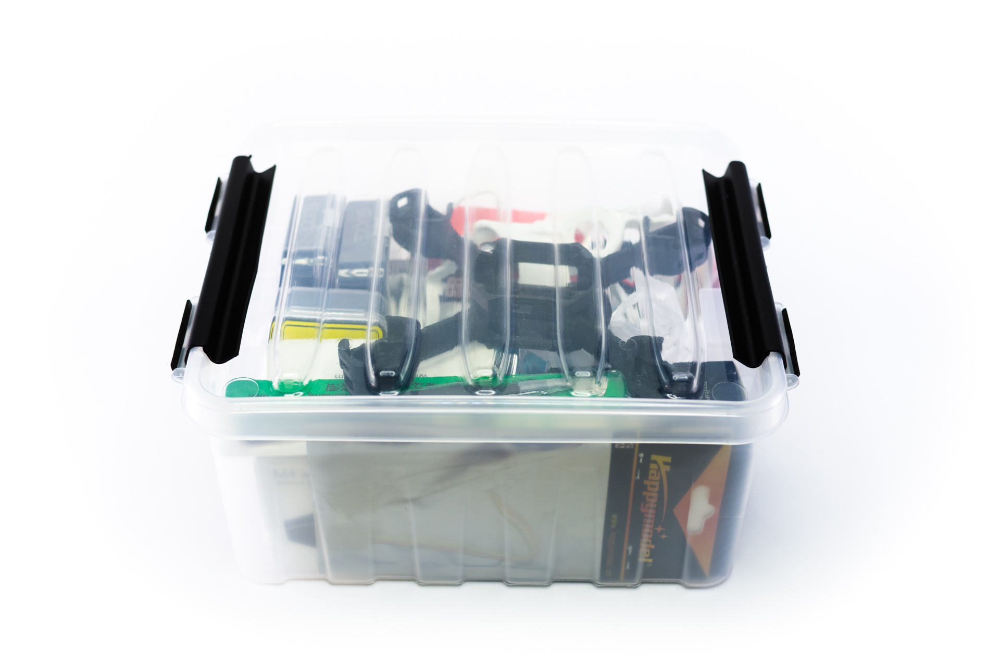
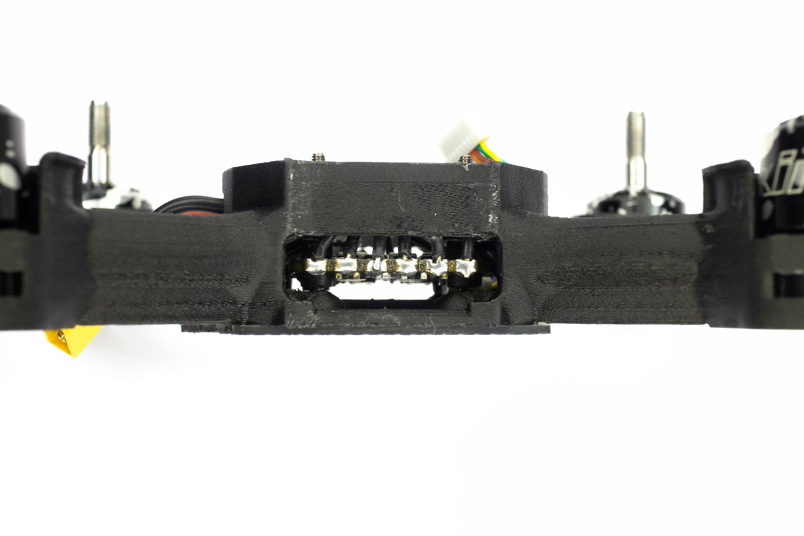
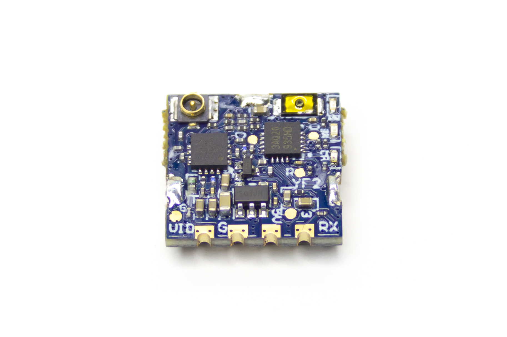
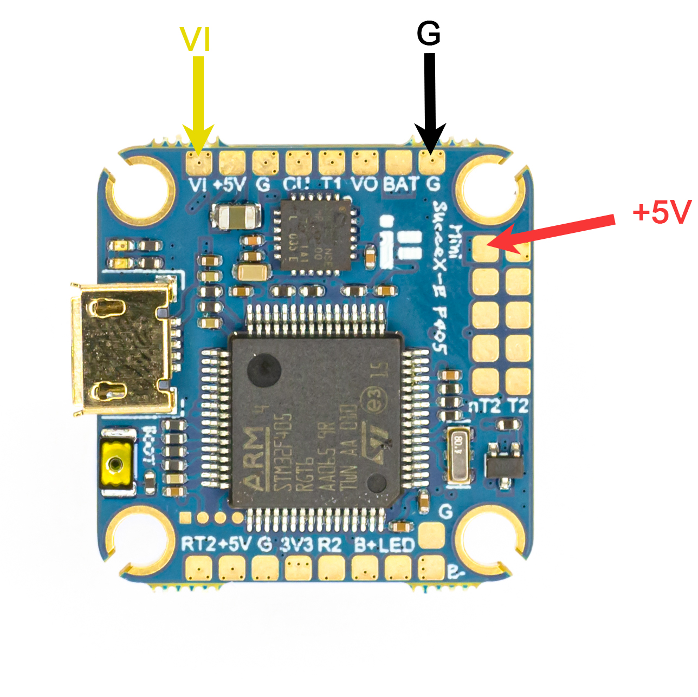
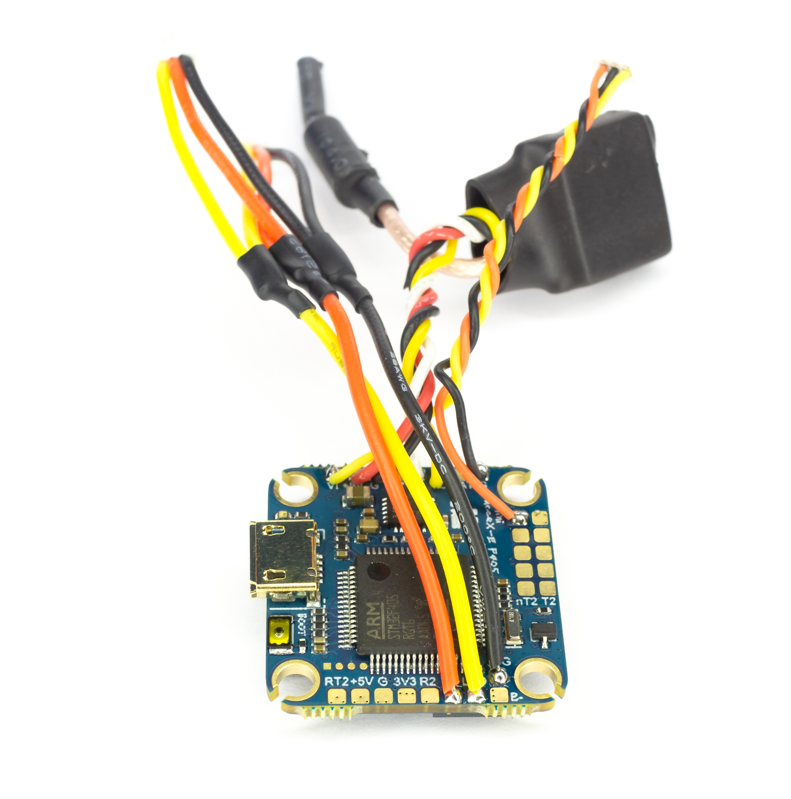
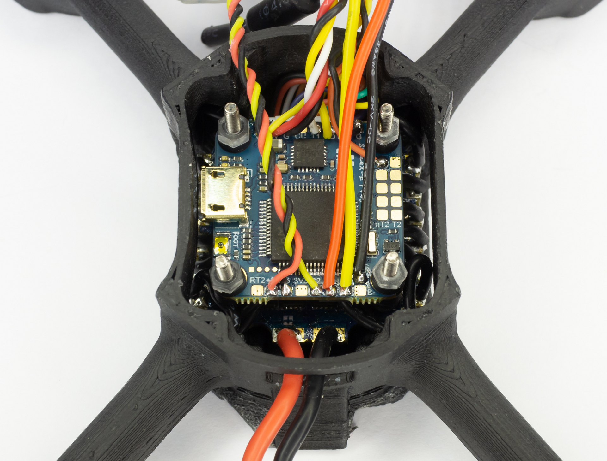

# Сборка гоночного дрона COEX Race Mini

COEX Race Mini - дрон который предназначен для гонок! При помощи него вы с легкостью освоите спортивное пилотирование.
Тренируйтесь и побеждайте! Увидимся на соревнованиях

## Комплект поставки
Внешний вид коробки:

Содержимое:

## Установка моторов
Установите ребро жесткости на раму, как это показано на видео:
<video src="video/hack.mp4" controls width="100%" ></video>
Изначально моторы поставляются с проводами одинаковой длины и гайками правого вращения:

Два мотора (они будут вращаться по часовой стрелке) обрежьте как показано на рисунке: нижний провод должен быть длиной 60 миллиметров, обозначим его буквой А; средний провод должен быть длиной 65 миллиметров, обозначим его буквой В; верхний провод должен быть длиной 70 миллиметров, обозначим его буквой С.

Другие два мотора (они будут вращаться против часовой стрелки) обрежьте как показано на другом рисунке:

Снимите 3 миллиметра изоляции с каждого провода и залудите их. Расположение моторов на дроне будет следующим: моторы, вращающиеся против часовой стрелки находятся на местах 1 и 4, моторы, вращающиеся по часовой стрелке располагаются на местах 2 и 3. На данном рисунке направление переда рамы обозначено стрелкой.

Установите моторы на места и закрепите с обратной стороны рамы, используя винты М2 из набора моторов:

## Установка ESC
Внешний вид ESC и кабеля питания:

Обрежьте кабель питания до длины в 20 миллиметров:

Снимите три миллиметра изоляции и залудите провода:

 Припаяйте их к плате, соблюдая полярность: красный провод необходимо подключить к контакту, обозначенному знаком +, а черный - к контакту, обозначенному знаком - :

Установите силиконовые проставки в отверстия:

Более длинная часть должна быть направлена вверх:

Вставьте шлейф в плату регуляторов:

Установите плату регуляторов со шлейфом в корпус, закрутите винтами М2x20 с обратной стороны.

Припаяйте выводы моторов к контактным площадкам: на рисунке ниже буква
 А
 соответствует короткому проводу, буква
 В -
 среднему, а буква
 С -
 длинному проводу.

Вид сбоку:

## Установка полетного контроллера

Внешний вид полетного контроллера:

### Подключение видеопередатчика
Для видеопередатчика IFlight воспользуйтесь данной инструкцией. Если в комплекте с дроном идет видеопередатчик Mamba, то 
шаги инструкции будут те же, но расположение выводов видеопередатчика будет отличаться:

  
Подключение Mamba VTX

Данный видеопередатчик имеет следующее расположение выводов:
 
Он подключается в следующей последовательности:
   <table>
        <tr><th>VTX</th><th>Полетный контроллер</th></tr>
        <tr>
             <td>
                  5V
             </td>
             <td>5v</td>
        </tr>
        <tr>
             <td>GND</td>
             <td>G</td>
        </tr>
        <tr>
             <td>VTX</td>
             <td>VO</td>
        </tr>
        <tr>
             <td>DATA </td>
             <td>T1</td>
        </tr>
   </table>

Видеопередатчик находится внутри этой коробочки:

Внутри находится сам видеопередатчик, адаптер для установки в отверстия 20х20 (он нам не понадобится), антенна, переходник для установки другой антенны (он также не понадобится) и провода:

На верхней стороне видеопередатчика находятся подписи контактных площадок:

С другой стороны располагается разъем для антенны и кнопка переключения каналов:

Припаяйте провода к видеопередатчику в следующей последовательности:
красный
провод к контакту +5V, **черный** - к контакту GND,
желтый - к контакту VIDEO и
белый - к контакту RX:

Вставите антенну в видеопередатчик:

Наденьте термоусадку на видеопередатчик и усадите её потоком горячего воздуха:

Обрежьте провода до длины в 60 миллиметров, залудите на 3 миллиметра и припаяйте провода к полетному контроллеру в следующей последовательности:
красный
провод к контакту +5V, **черный** - к контакту G,
желтый - к контакту VO и
белый - к контакту T1:

Вот так это будет выглядеть:

### Подключение камеры

Внешний вид камеры:

Обрежьте ответный кабель разъема камеры на длину в 50 миллиметров, и залудите концы на длину в 3 миллиметра. Припаяйте его к полетному контроллеру в следующем порядке:
**черный** провод - к контакту G,
желтый - к контакту VI,
красный - к контакту +5 вольт, как показано на схеме:

Припаянный провод должен выглядеть следующим образом:

### Подключение светодиодной ленты

В комплекте со светодиодной лентой идет провод:

Припаяйте провода к полетному контроллеру в следующей последовательности:
**G** к контакту G,
5v к контакту B+ полетного контроллера, и
sig к контакту LED, как показано на схеме:

Припаянный провод должен выглядеть следующим образом:

### Подключение радиоприемника

Внешний вид радиоприемника:

Обрежьте провода приемника на длину 50 миллиметров и залудите концы на длину 3 миллиметра. Припаяйте провода к полетному контроллеру в следующем порядке:
красный
провод к контакту +5V, **черный** - к контакту G,
желтый - к контакту R2, как показано на рисунке:

Припаянный провод должен выглядеть следующим образом:

Наденьте термоусадку на радиоприемник и усадите:

После этого подключите приемник к припаянному только что кабелю.

### Установка полетного контроллера в корпус
Вставьте силиконовые проставки в полетный контроллер в соответствие со схемой:

Подключите шлейф, идущий от регуляторов к полетному контроллеру, установите его в корпус и зафиксируйте гайками:

## Подключение аппаратуры радиоуправления

Если сейчас подключить аккумулятор к дрону, то светодиод на приемнике начнет медленно мигать:
<picture>
   <source srcset="img/rx_unbinded.avif" type="image/avif">
   <source srcset="img/rx_unbinded.webp" type="image/webp">
   
</picture>
Это означает, что радиоприемник не получает сигнал от аппаратуры радиоуправления. Такое может происходить в двух случаях:

1. Аппаратура радиоуправления выключена
2. Радиоприемник и аппаратура радиоуправления не настроены для работы друг с другом

Для радиоуправления дроном необходимо настроить радиоприемник на работу с конкретной радиоаппаратурой (данная процедура называется bind). Для этого необходимо при выключенном питании дрона нажать кнопку Bind на радиоприемнике, после чего с зажатой кнопкой подключить аккумулятор. Светодиод на радиоприемнике начнет быстро мигать:
<picture>
   <source srcset="img/rx_binding.avif" type="image/avif">
   <source srcset="img/rx_binding.webp" type="image/webp">
   
</picture>

После этого зажмите кнопку Bind на аппаратуре управления и включите ее:

В случает успеха светодиод на радиоприемнике будет гореть постоянно:

А на экране аппаратуры радиоуправления будет отображаться напряжение питания приемника:

## Финальная сборка

Внешний вид канопы с камерой:

Установите камеру внутри канопы и зафиксируйте винтами:

Подключите камеру к полетному контроллеру. Расположите радиоприемник и видеопередатчик внутри канопы. Проденьте разъемы для светодиодных лент в отверстия канопы и подключите их.

Защелкните светодиодные ленты в их посадочных местах:

Подключите переходник USB и выполните
[настройку дрона](setup):

После того, как настройка закончена, защелкните канопу на дроне:

Переверните дрон нижней стороной вверх:

Наклейте противоскользящую накладку:

На этом сборка завершена.
