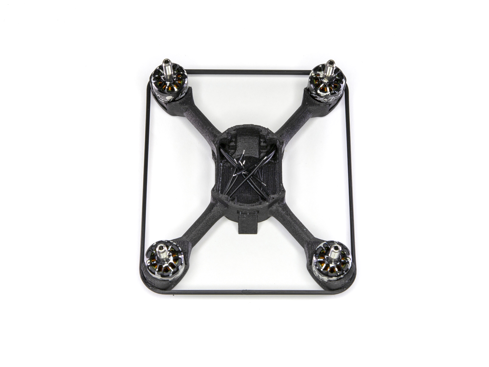
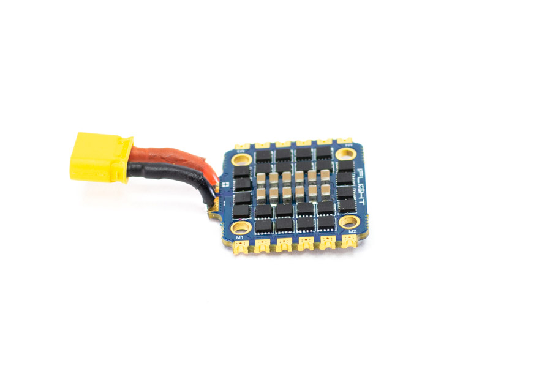
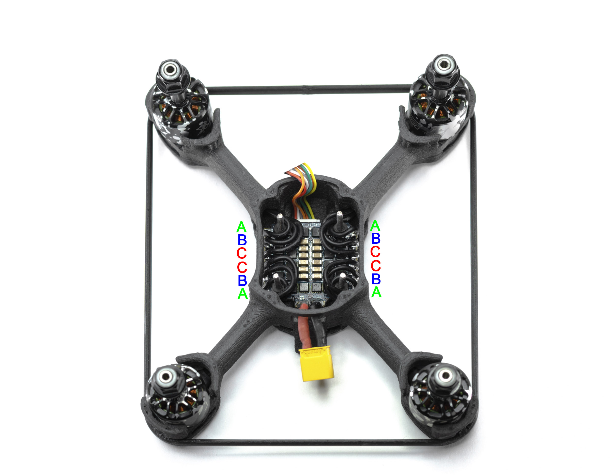
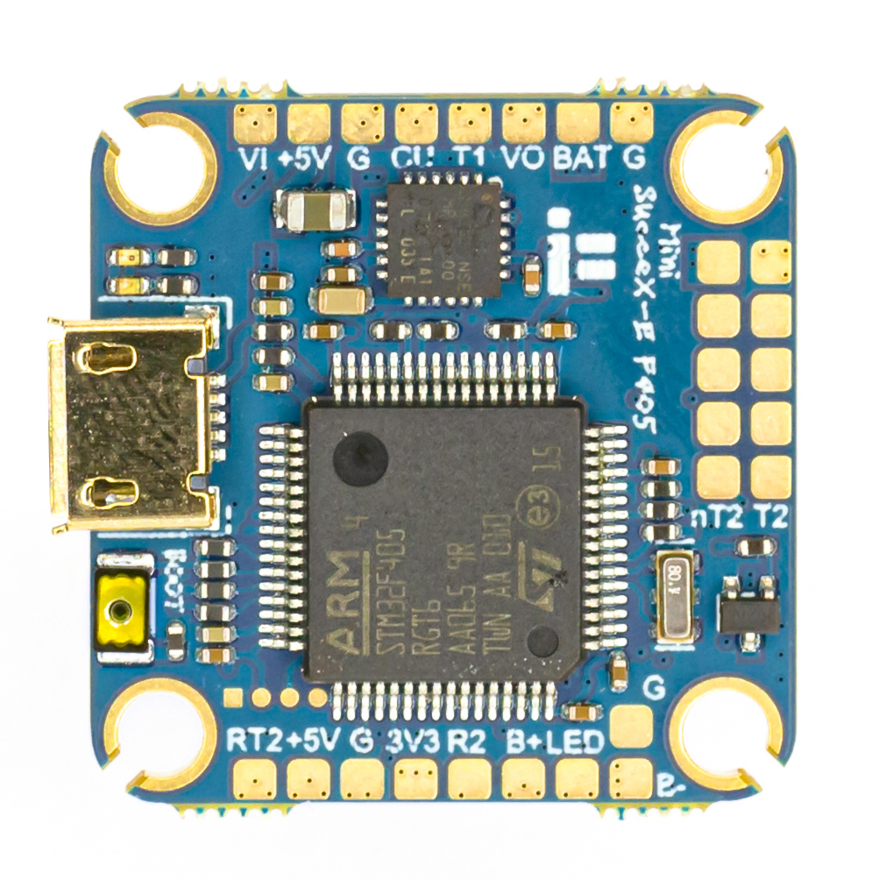
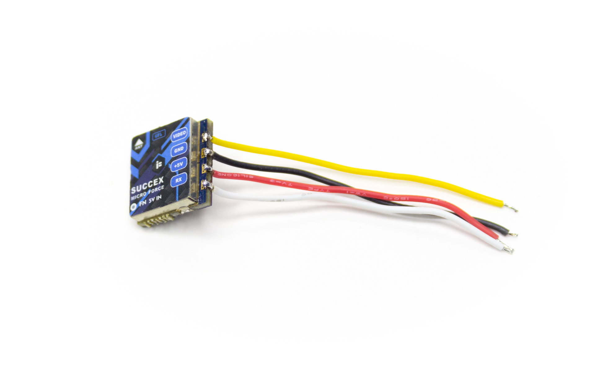
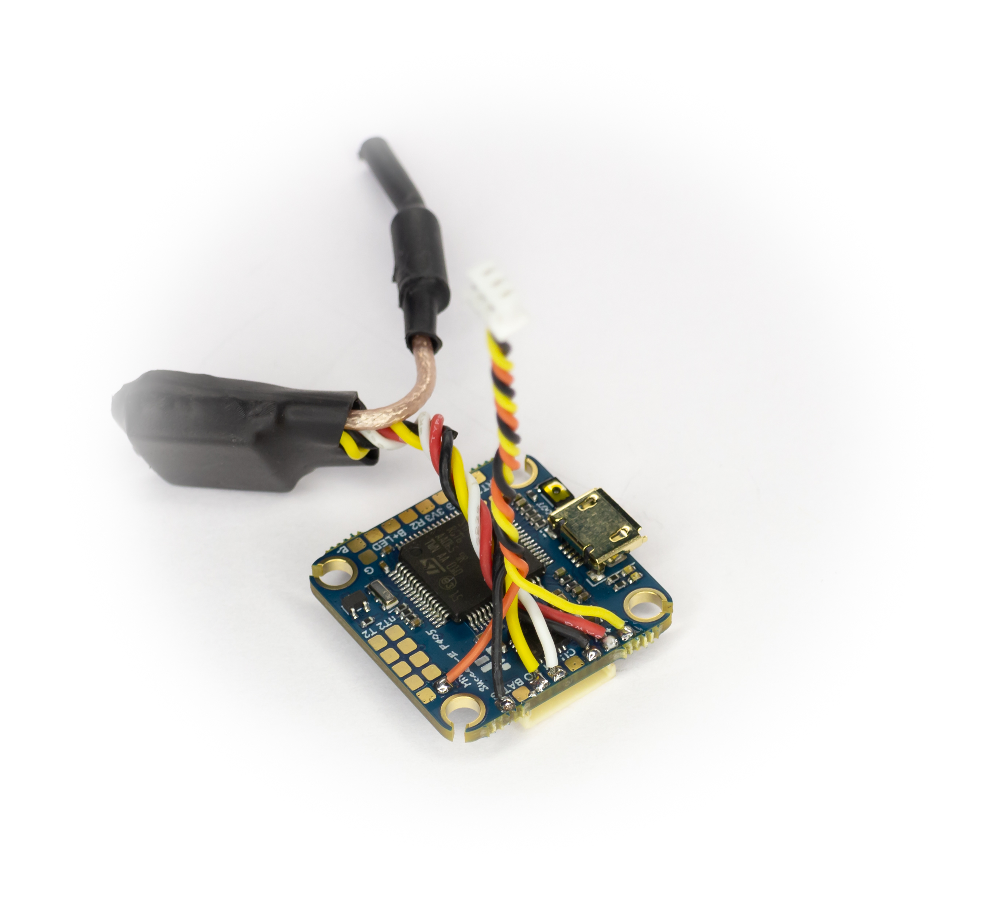
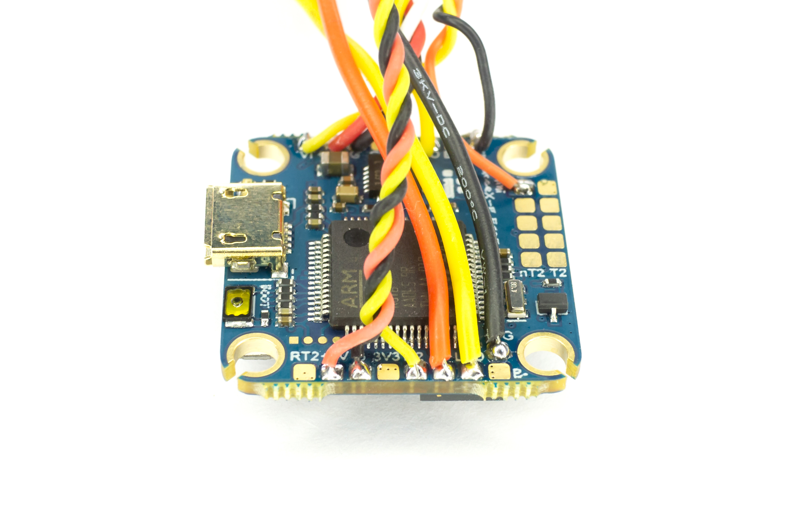
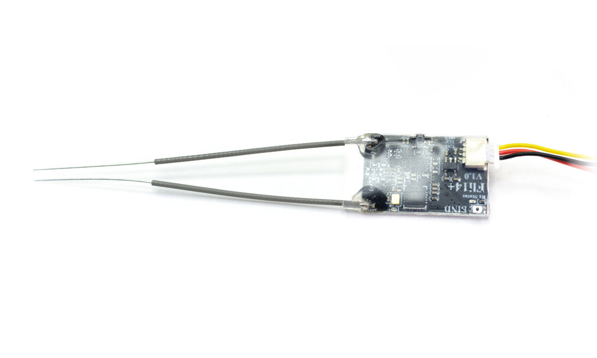

# Сборка гоночного дрона COEX Race Mini

COEX Race Mini - дрон который предназначен для гонок! При помощи него вы с легкостью освоите спортивное пилотирование.
Тренируйтесь и побеждайте! Увидимся на соревнованиях

## Комплект поставки
Внешний вид коробки:

Содержимое:

## Установка моторов

Изначально моторы поставляются с проводами одинаковой длины:

Два мотора (они будут вращаться по часовой стрелке) обрежьте как показано на рисунке: нижний провод должен быть длиной 60 миллиметров, обозначим его буквой А; средний провод должен быть длиной 65 миллиметров, обозначим его буквой В; верхний провод должен быть длиной 70 миллиметров, обозначим его буквой С.

Другие два мотора (они будут вращаться против часовой стрелки) обрежьте как показано на другом рисунке:

Снимите 3 миллиметра изоляции с каждого провода и залудите их. Расположение моторов на дроне будет следующим: моторы, вращающиеся против часовой стрелки находятся на местах 2 и 4, моторы, вращающиеся по часовой стрелке располагаются на местах 1 и 3. На данном рисунке направление переда рамы обозначено стрелкой.

Установите моторы на места и закрепите с обратной стороны рамы, используя винты М2 из набора моторов:

## Установка ESC
Внешний вид ESC и кабеля питания:

Обрежьте кабель питания до длины в 20 миллиметров:

Снимите три миллиметра изоляции и залудите провода:

 Припаяйте их к плате, соблюдая полярность: красный провод необходимо подключить к контакту, обозначенному знаком +, а черный - к контакту, обозначенному знаком - :

Установите силиконовые проставки в отверстия:

Вставьте шлейф в плату регуляторов:

Установите плату регуляторов со шлейфом в корпус, закрутите длинными винтами М2 с обратной стороны.

Припаяйте выводы моторов к контактным площадкам: на рисунке ниже буква
 А
 соответствует короткому проводу, буква
 В -
 среднему, а буква
 С -
 длинному проводу.

## Установка полетного контроллера

Внешний вид полетного контроллера:

### Подключение видеопередатчика
Видеопередатчик находится внутри этого пакета:

Внутри находится сам видеопередатчик, кнопка переключения каналов, антенна, термоусадка и провода:

На верхней стороне видеопередатчика располагается разъем для антенны:

С другой стороны имеются подписи контактных площадок:

Припаяйте провода к видеопередатчику в следующей последовательности:
красный
провод к контакту 5V, **черный** - к контакту G,
желтый - к контакту V и
зеленый - к контакту S:

Обрежьте провода до длины в 60 миллиметров, залудите на 3 миллиметра и припаяйте провода к полетному контроллеру в следующей последовательности:
красный
провод к контакту +5V, **черный** - к контакту G,
желтый - к контакту VO и
зеленый - к контакту T1:

Вставите антенну в видеопередатчик:

Наденьте термоусадку на видеопередатчик и усадите её потоком горячего воздуха:

### Подключение камеры

Внешний вид камеры:

Обрежьте ответный кабель разъема камеры на длину в 50 миллиметров, и залудите концы на длину в 3 миллиметра. Припаяйте его к полетному контроллеру в следующем порядке:
**черный** провод - к контакту G,
желтый - к контакту VI,
красный - к дополнительному контакту +5 вольт, обозначенному на рисунке:

Припаянный провод должен выглядеть следующим образом:

### Подключение радиоприемника

Внешний вид радиоприемника:

Обрежьте провода приемника на длину 50 миллиметров и залудите концы на длину 3 миллиметра. Припаяйте провода к полетному контроллеру в следующем порядке:
красный
провод к контакту +5V, **черный** - к контакту G,
желтый - к контакту R2:

Подключите радиоприемник, наденьте на него термоусадку и усадите:

