# Настройка пульта

Перед настройкой полетного контроллера необходимо выполнить настройку пульта. После того, как вы произвели бинд приемника и пульта, на включенном пульте удерживайте клавишу OK (сам дрон должен быть выключен). Вы попадете в меню:
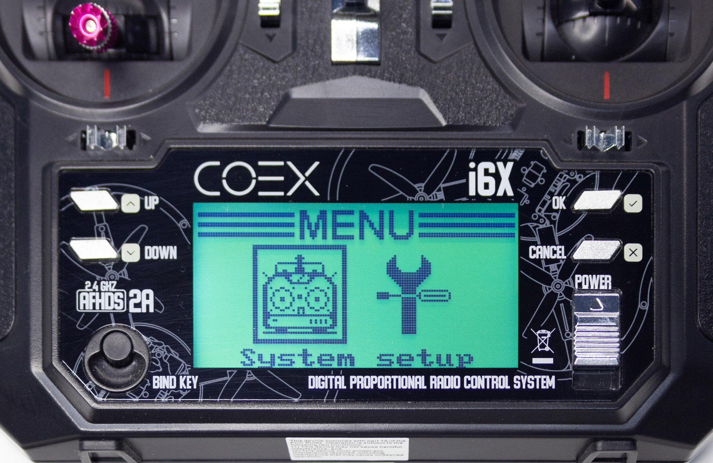
Убедитесь, что подсвечена вкладка System и нажмите OK. Вы попадете в меню системных настроек:
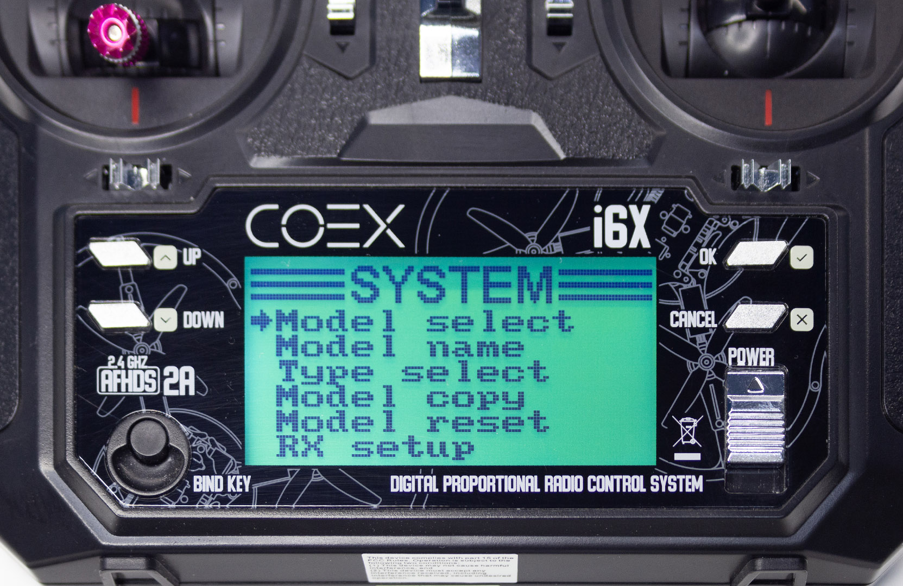
Нажимая на кнопку DOWN пролистайте меню вниз, до пункта Aux switches:
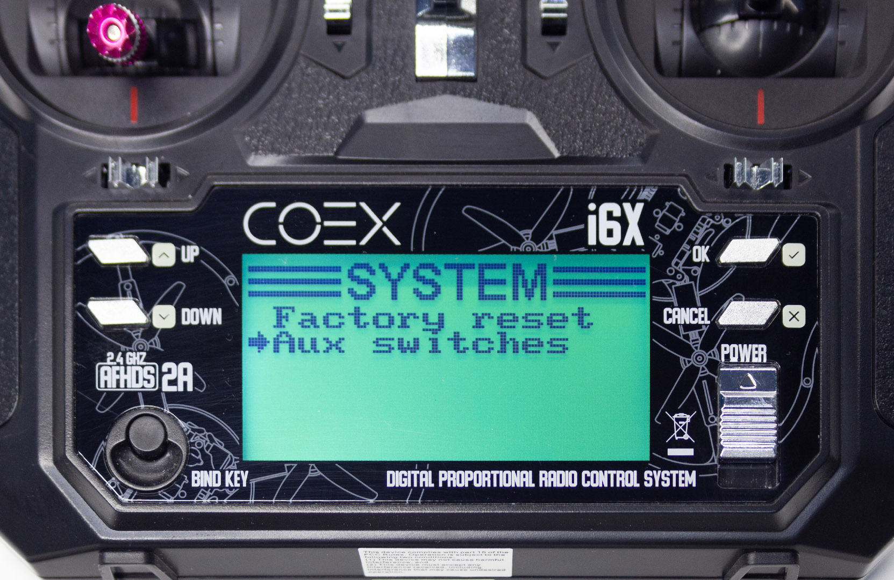
Нажмите OK, вы попадете в раздел настройки дополнительных каналов:
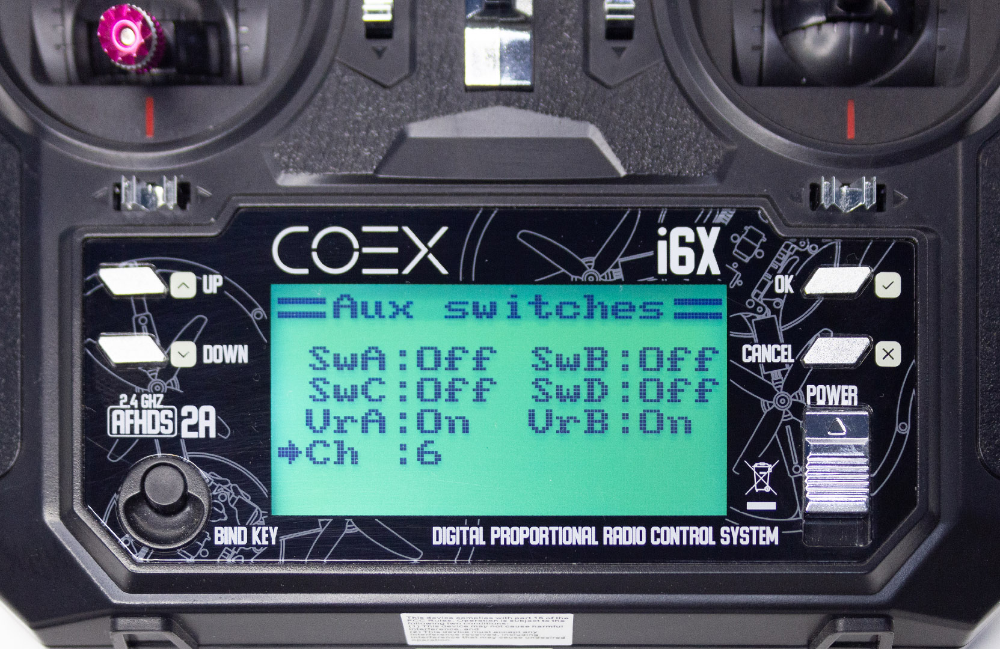
По умолчанию количество каналов равно шести, а все свитчи находятся в положении Off. При помощи кнопки UP настройте все свичи в положение On, также увеличьте количество каналов до 10. Переключение между пунктами меню происходит при помощи клавиши OK. В конечном итоге все настройки должны выглядеть следующим образом:
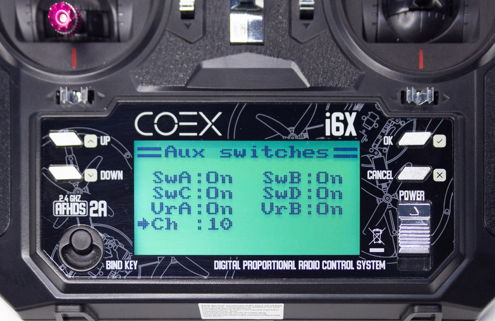
>**ВНИМАНИЕ** Сохранение настроек производится с помощью долгого нажатия на клавишу CANCEL. Если просто нажать на эту клавишу, настройки сохранены не будут

Сохраните настройки, вы попадете в предыдущее меню:

Еще раз нажмите клавишу CANCEL:

При помощи клавиш UP и DOWN выберите пункт setup:
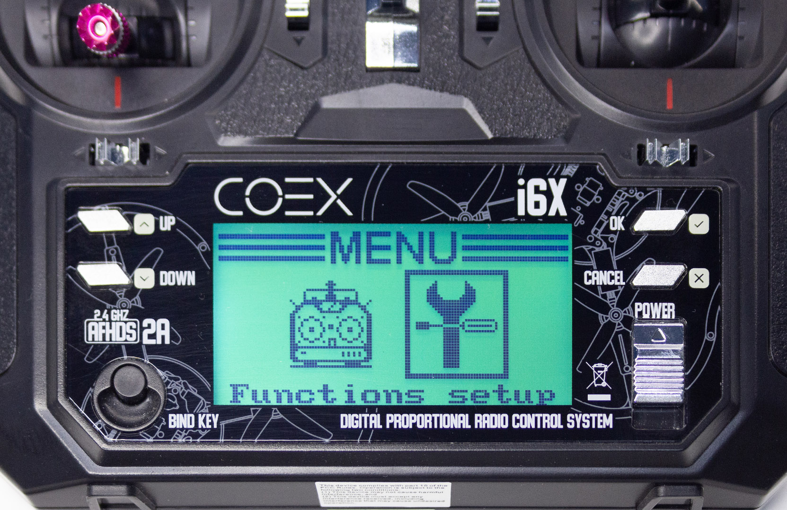
Нажмите OK, вы попадете в меню настройки функций:
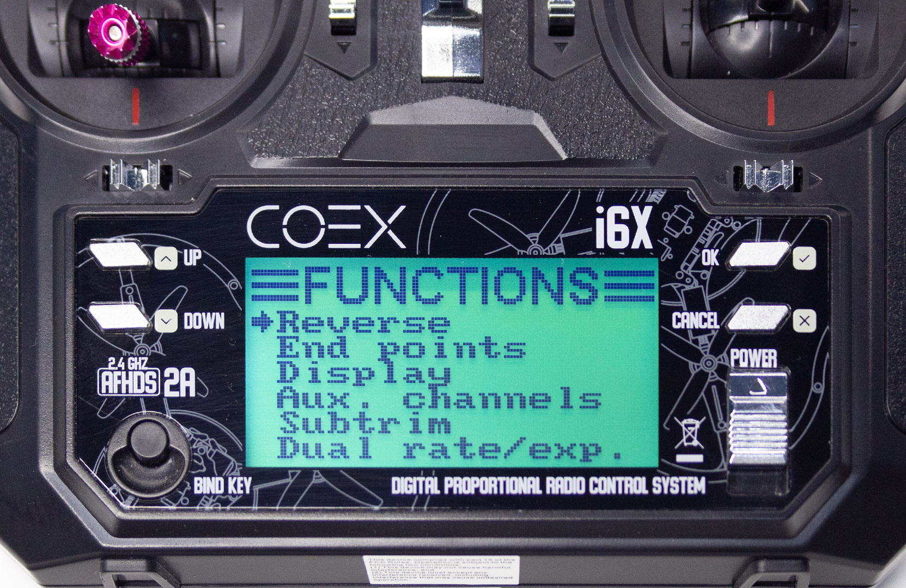
Клавишей DOWN выберите пункт Aux. channels:
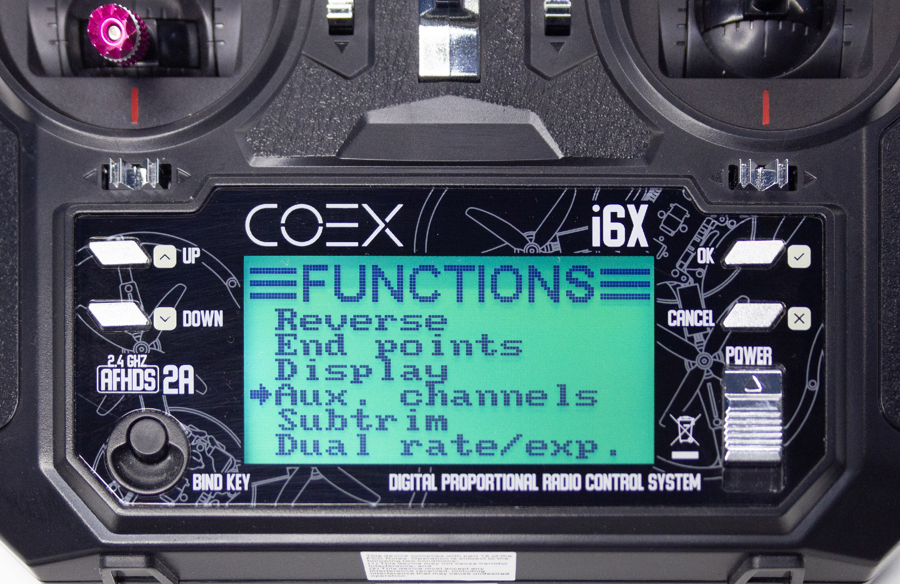
Нажмите OK, вы попадете в меню настройки дополнительных каналов. По умолчанию оно выглядит так:
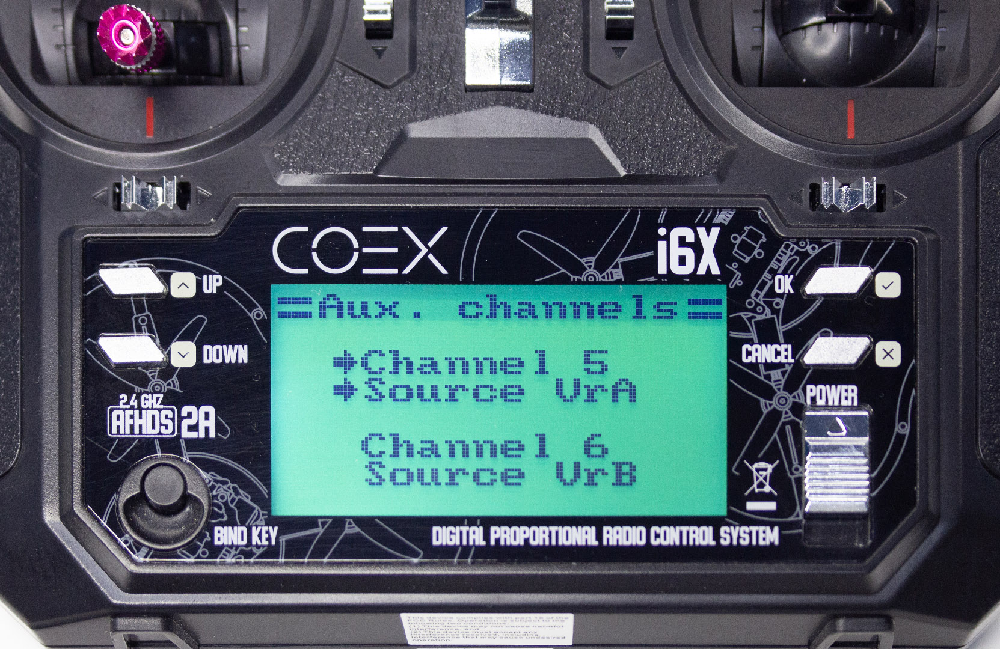
При помощи клавиш UP и DOWN установите переключатели SwD, SwC, SwB, SwA в соответствие каналам 5, 6, 7, 8. Переключение между пунктами меню происходит при помощи клавиши OK. В конечном итоге пункты меню должны выглядеть таким образом:
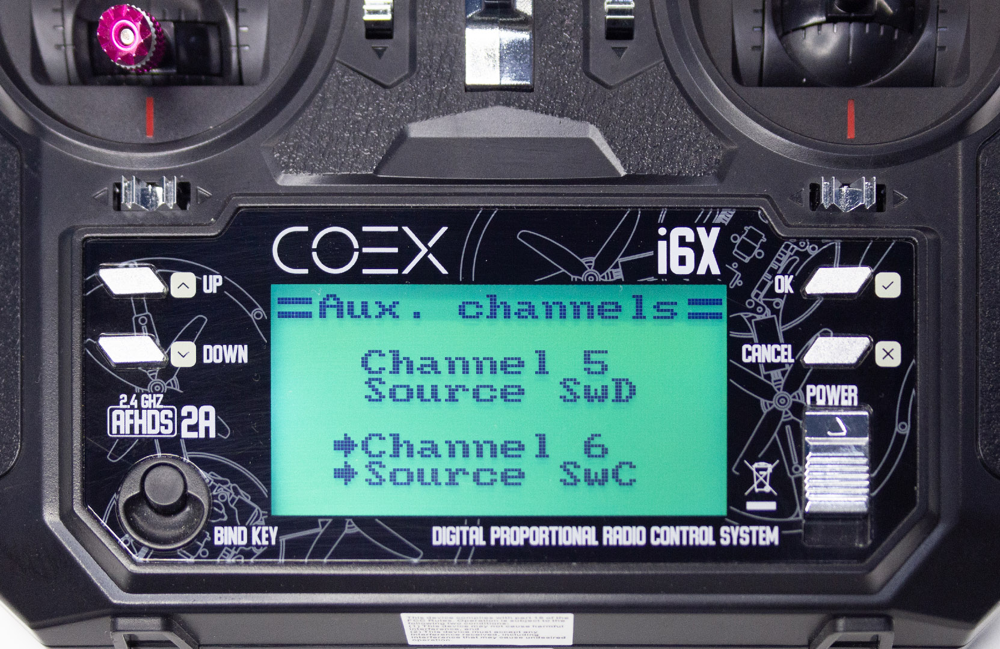
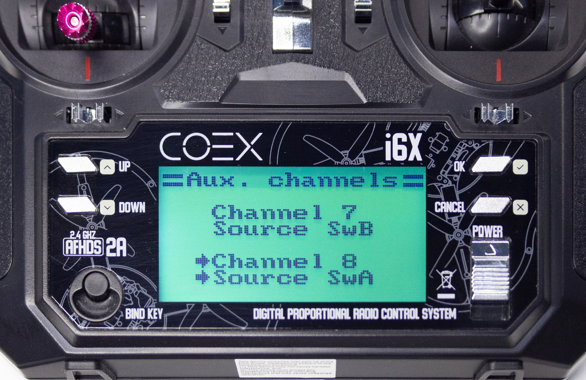
Сохраните настройки долгим нажатием на клавишу CANCEL.

На этом настройка пульта закончена, вы можете переходить к настройке полетного контроллера.
