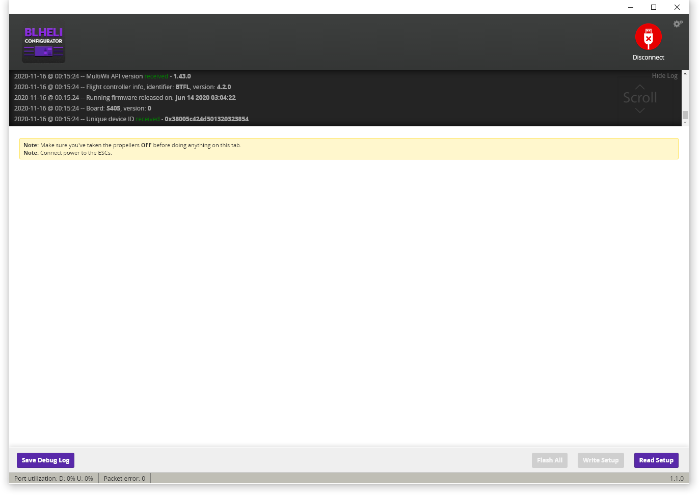

# Настройка полетного контроллера

## Прошивка полетного контроллера

Скачайте последнюю версию Betaflight Configurator из [официального репозитория](https://github.com/betaflight/betaflight-configurator/releases) и установите её на свой компьютер. Запустите Betaflight Configurator. Зажмите кнопку на полетном контроллере и подключите его к компьютеру с помощью разъема Micro USB. Убедитесь, что в Betaflight Configurator полетный контроллер отображается в режиме **DFU**. Нажмите на кнопку Update Firmware. В списке плат выберите **BETAFLIGHTF4**, в списке версий выберите последнюю стабильную версию. Нажмите Load Firmware [Online], а затем Flash Firmware.

После удачной прошивки подключитесь к полетному контроллеру и перейдите во вкладку **CLI** Откройте <a href="../res/dump.txt" target="_blank">файл конфигурации</a>, скопируйте его содержимое и вставьте в строку ввода команд, затем нажмите Enter. Полетный контроллер перезапустится. На этом его настройка закончена.

## Настройка ESC

Откройте Betaflight Configurator и перейдите во вкладку Motors. Подключите аккумулятор, предварительно убедившись, что на дроне **отсутствуют пропеллеры**. Нажмите на переключатель **I understand the risks**, после чего плавно поднимите ползунок Master вверх до тех пор, пока все моторы не начнут слегка вращаться. Проверьте, вращаются ли все моторы так же, как указано на картинке:

Если все моторы вращаются в нужном направлении, то их дальнейшая настройка не требуется. Если есть моторы, которые вращаются не в ту сторону, запомните их номера, для них нужно будет сменить направление вращения.
 Установите BLHeli Configurator из [официального репозитория](https://github.com/blheli-configurator/blheli-configurator/releases). Закройте Betaflight Configurator, перейдите в BLHeli Configurator, нажмите на копку Connect, а затем Read Setup Read Setup. Аккумулятор в этот момент должен быть подключен к дрону.
 
 В результате должен появиться список регуляторов. Для моторов, вращавшихся в неправильном направлении, в списке Motor Direction смените Normal на Reversed, после чего нажмите Write Setup.
  
  На этом настройка дрона завершена, можно устанавливать пропеллеры и приступать к полетам.
